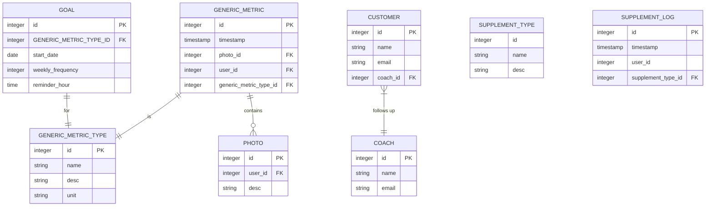

```mermaid
erDiagram

    GENERIC_METRIC {
      integer id PK
      timestamp timestamp
      integer photo_id FK
      integer user_id FK
      integer generic_metric_type_id FK
    }

    GENERIC_METRIC_TYPE {
      integer id PK
      string name
      string desc
      string unit
    }

    CUSTOMER {
      integer id PK
      string name
      string email
      integer coach_id FK
    }

    COACH {
      integer id PK
      string name
      string email
    }

    PHOTO {
      integer id PK
      integer user_id FK
      string desc
    }

    GOAL {
      integer id PK
      integer GENERIC_METRIC_TYPE_ID FK
      date start_date
      integer weekly_frequency
      time reminder_hour
    }

    SUPPLEMENT_TYPE {
      integer id
      string name
      string desc
    }

    SUPPLEMENT_LOG {
      integer id PK
      timestamp timestamp
      integer user_id
      integer supplement_type_id FK
    }

    CUSTOMER 1+--1 COACH : "follows up"
    GENERIC_METRIC 1--1 GENERIC_METRIC_TYPE : is
    GENERIC_METRIC 1--0+ PHOTO : contains
    GOAL 1--1 GENERIC_METRIC_TYPE : for


```